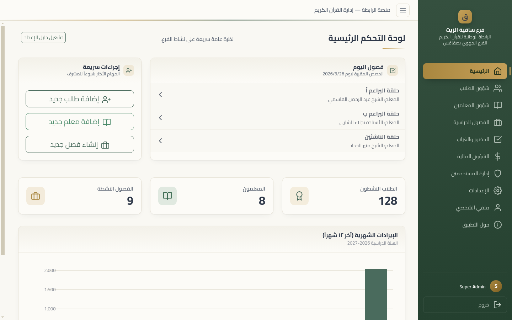
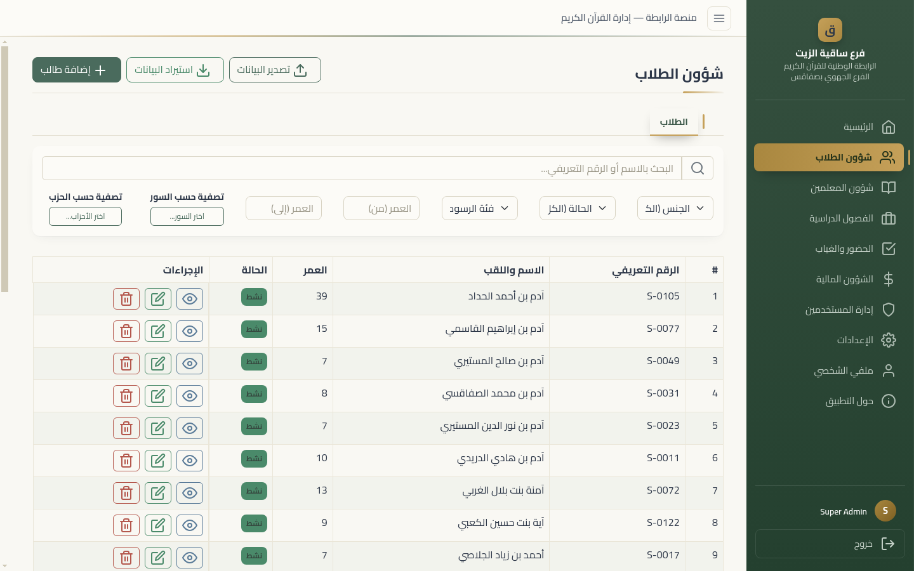
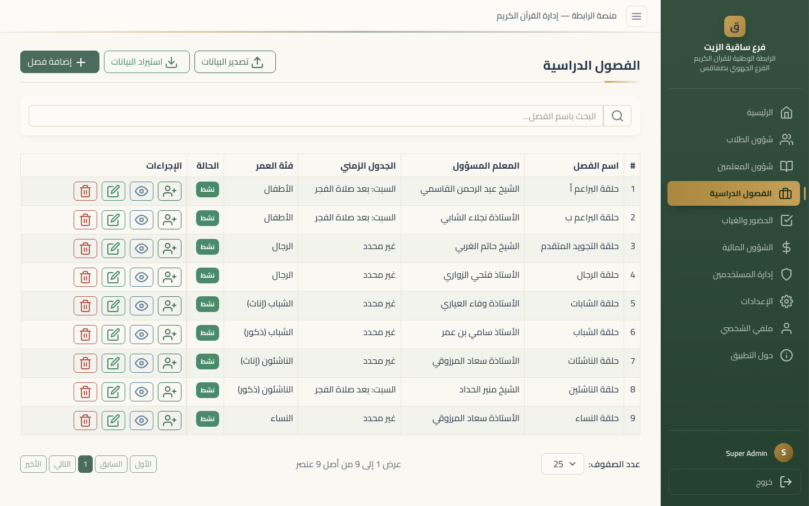
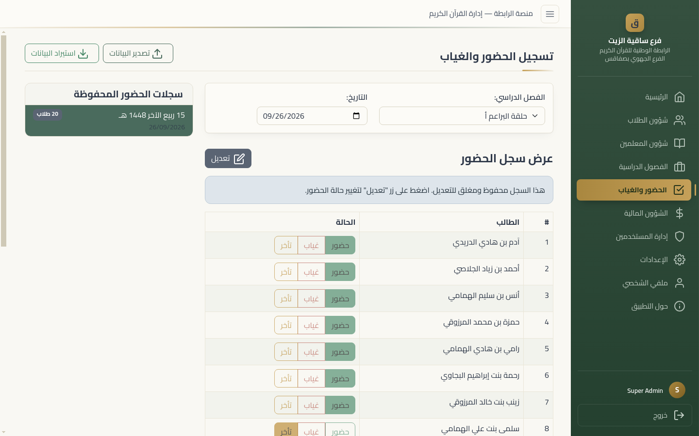
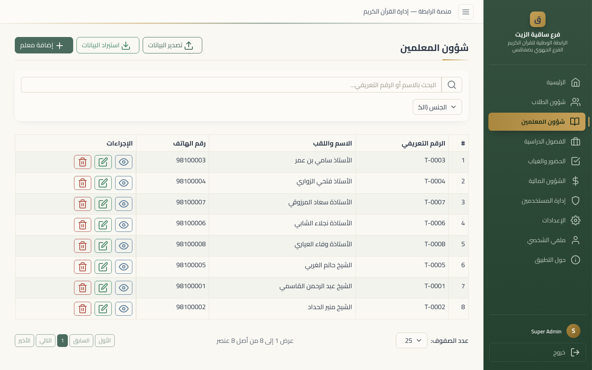
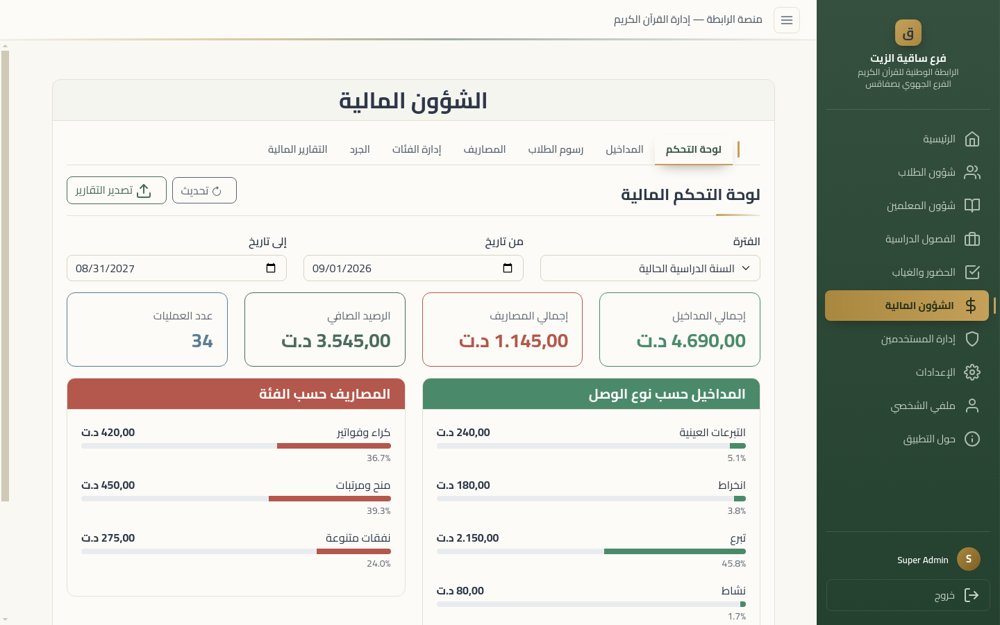
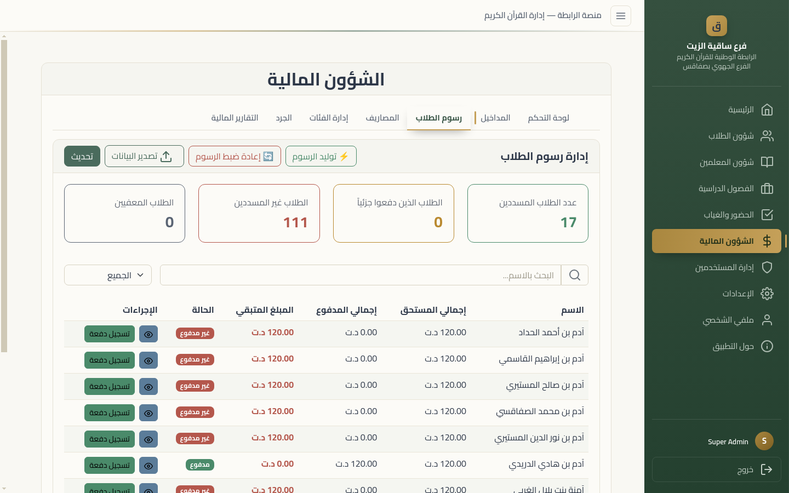
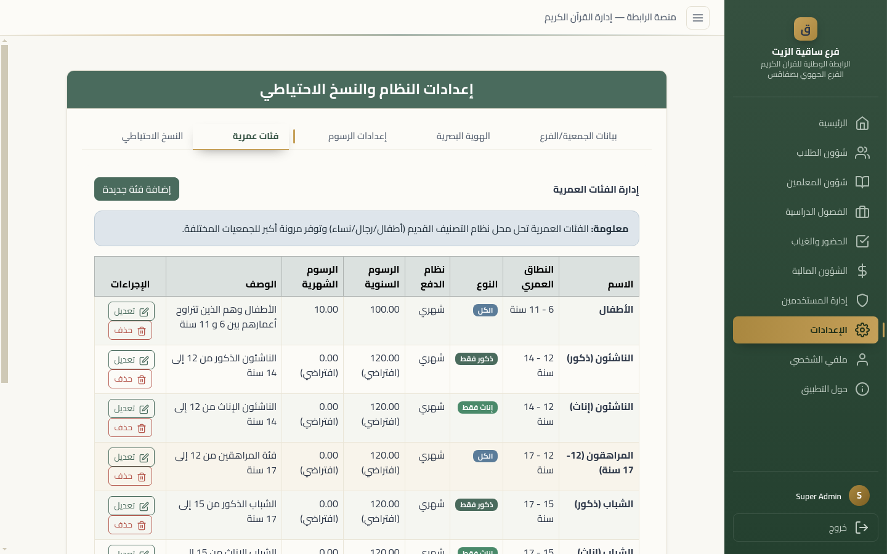
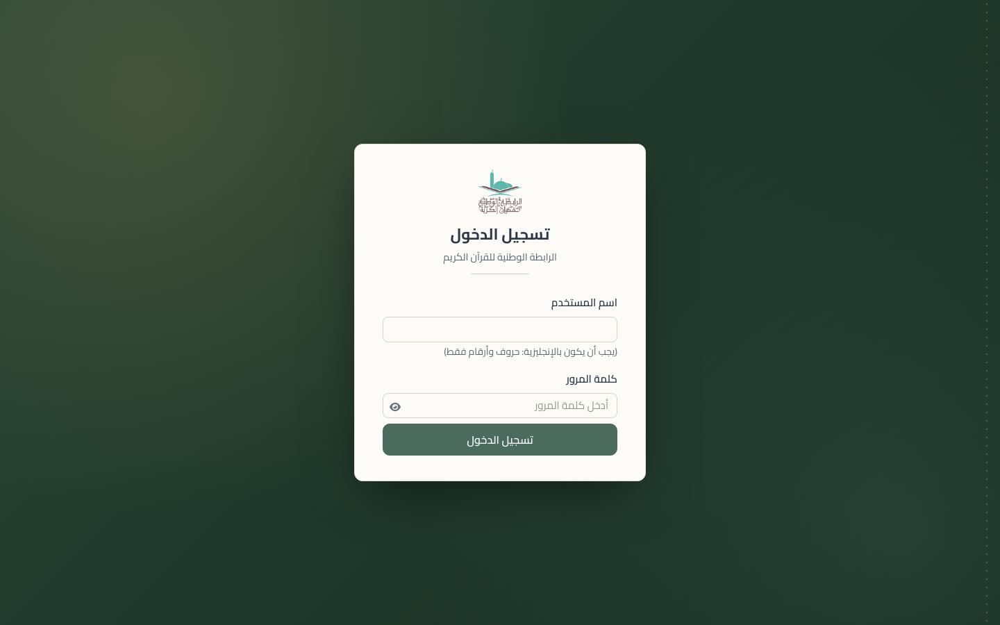

# Quran Branch Manager

**Quran Branch Manager** is a desktop application for Windows designed to streamline the administrative operations of Quranic associations. Built with Electron and React, it provides an offline-first, secure, and user-friendly system to manage students, teachers, classes, finances, and more.

This application was developed to replace manual, paper-based workflows, offering a digital solution tailored to the needs of organizations like the National Quran Association in Tunisia.



## ✨ Features

- **Student Management:** Enroll students, track memorization progress, and manage personal and contact information.
- **Teacher & Class Management:** Manage teacher profiles, create class schedules, and assign students and teachers to classes.
- **Attendance Tracking:** Record and monitor student attendance with ease, and generate detailed reports.
- **Financial Management:** A complete module to track student payments, teacher salaries, donations (cash and in-kind), and general expenses. Student fees are billed monthly or yearly per age group, each age group can have its own fees, and unpaid fees from earlier academic years are kept apart.
- **Comprehensive Reporting:** Generate and export detailed reports for students, attendance, and financials in PDF, Excel and Word formats.
- **Inventory:** Track in-kind donations and stock movements, with an inventory ledger export.
- **Role-Based Access Control:** Secure login with four roles (Superadmin, Administrator, Finance Manager, Session Supervisor); a user can hold several. Every IPC call is checked against the user's roles in the main process.
- **Offline-First:** The application works without an internet connection, storing all data locally in an encrypted SQLite database on your computer.
- **Arabic Language Support:** A full Right-to-Left (RTL) interface designed for Arabic-speaking users.
- **Data Backup & Import:** Encrypted, signed backups (manual or scheduled) that can be restored on another computer with the association transfer key, and an Excel import wizard.

## 📸 Gallery

Screenshots from the real-world test scenario (`npm run test:e2e:realworld`): a branch with
128 students, 8 teachers and 9 classes, with attendance and finances. The names are fictional.
Regenerate them with `npm run docs:screenshots` after running the scenario.

|                                                                                             |                                                                     |
| ------------------------------------------------------------------------------------------- | ------------------------------------------------------------------- |
|  **Students**                                     |  **Classes**                |
|  **Attendance**                               |  **Teachers**             |
|  **Financial dashboard**    |  **Student fees** |
|  **Age groups and their fees** |  **Login**                      |

## 🎬 Video guide (Arabic)

A recorded tour of the app from a fresh install: first login, fees, teachers, students,
classes, attendance, student fees, income and expenses, and backup. Every step is explained in
Arabic before it happens. It is an e2e test, so each step is also checked against the app.

- `npm run docs:guide` records it with **Arabic captions on screen**.
- `npm run docs:guide:audio` records it with a **spoken Arabic narration** instead
  (`QBM_GUIDE_MODE=both` gives captions and narration).
- `npm run docs:guide:mp4` then makes `guide.mp4` and one MP4 per chapter in
  `guide-output/chapters/`, with the narration as sound (and, in audio mode, the captions as
  subtitles that can be turned on). Needs ffmpeg with libx264; set `FFMPEG_PATH` if it is not on
  the PATH.

Output goes to `guide-output/`: `guide.webm`, Arabic subtitles (`captions.vtt`), chapter timings,
`narration.wav` and the written steps (`guide.md`). `QBM_GUIDE_PACE=0.3` records a quick version.

The narration uses a text-to-speech engine, chosen with `QBM_GUIDE_TTS`:

| Engine           | Setup                                                                | Voice (`QBM_GUIDE_VOICE`)                                              |
| ---------------- | -------------------------------------------------------------------- | ---------------------------------------------------------------------- |
| `edge` (default) | `pip install edge-tts`; needs internet                               | `ar-TN-ReemNeural` (default), `ar-TN-HediNeural`, `ar-SA-HamedNeural`… |
| `espeak`         | `espeak-ng` (+ `mbrola-ar1` for a better voice); offline, robotic    | `mb-ar1` (default) or `ar`                                             |
| `command`        | any engine: `QBM_GUIDE_TTS_CMD='piper -m ar.onnx -f {out} < {text}'` | —                                                                      |

Speech speed: `QBM_GUIDE_TTS_RATE` (e.g. `-5%` for edge, words per minute for espeak). Spoken
sentences are cached in `guide-output/tts-cache/`, so re-recording doesn't synthesize again.

## 🚀 Getting Started

### Prerequisites

- [Node.js](https://nodejs.org/) (v22.x.x or later)
- [npm](https://www.npmjs.com/) (v10.x.x or later)

### Development

To run the application in development mode with live reloading:

1.  **Clone the repository:**
    ```bash
    git clone https://github.com/SalimElheni1/quran-association-manager.git
    cd quran-association-manager
    ```
2.  **Install dependencies:**
    ```bash
    npm install
    ```
3.  **Run the development server:**
    ```bash
    npm run dev
    ```

### Testing

```bash
npm test              # Jest unit and integration tests (main process and renderer)
npm run lint          # ESLint + Prettier
npm run test:e2e      # Playwright end-to-end tests against the built Electron app
```

See the [Testing Guide](docs/dev/setup/testing.md) for the real-world scenario and the video guide.

### Building for Production

To build the Windows installer:

```bash
npm run dist
```

The installer will be located in the `release/` directory. Pushing a version tag (`v` + the
version in `package.json`) builds it on GitHub Actions and publishes a GitHub release. For more
details, see the [Build and Packaging documentation](docs/dev/setup/building.md).

## 🏁 من هنا نبدأ (Start Here)

**مرحباً بكم في تطبيق مدير الفروع القرآنية!**

هذا التطبيق مصمم لتسهيل إدارة الجمعيات القرآنية. إليكم الروابط الأساسية:

- **📖 [دليل المستخدم (عربي)](docs/user/manual.md):** شرح شامل لكيفية استخدام البرنامج (إضافة طلاب، تسجيل حضور، مالية).
- **💰 [الدليل المالي (عربي)](docs/user/financial.md):** شرح خاص للنظام المالي الموحد.
- **🔧 [حل المشاكل (عربي)](docs/user/troubleshooting.md):** ماذا تفعل إذا واجهت مشكلة؟

---

## 📚 Documentation map

The project documentation is organized by audience and purpose. Use the index below to navigate the active material and avoid archived or historical notes when working on the current product.

- [docs/README.md](docs/README.md) — central documentation index for the whole project
- [PRODUCT.md](PRODUCT.md) — product scope, positioning, and constraints
- [CONTRIBUTING.md](CONTRIBUTING.md) — contribution workflow and standards
- [CHANGELOG.md](CHANGELOG.md) — version history and user-facing changes
- [SECURITY_REMEDIATION_PLAN.md](SECURITY_REMEDIATION_PLAN.md) — current security roadmap and status
- [docs/user/manual.md](docs/user/manual.md) — end-user guide in Arabic
- [docs/user/financial.md](docs/user/financial.md) — finance-specific user workflow
- [docs/user/troubleshooting.md](docs/user/troubleshooting.md) — user support steps
- [docs/dev/setup/development.md](docs/dev/setup/development.md) — local setup and workflow
- [docs/dev/setup/building.md](docs/dev/setup/building.md) — production build and packaging
- [docs/dev/setup/testing.md](docs/dev/setup/testing.md) — automated test guidance
- [docs/dev/specs/architecture.md](docs/dev/specs/architecture.md) — architecture overview
- [docs/dev/specs/api.md](docs/dev/specs/api.md) — IPC API and technical contract
- [docs/dev/specs/security.md](docs/dev/specs/security.md) — security model and implementation notes
- [docs/dev/reference/project-structure.md](docs/dev/reference/project-structure.md) — repository layout
- [docs/dev/troubleshooting.md](docs/dev/troubleshooting.md) — common technical issues

## 🤝 Contributing

Contributions are welcome! Please read our [**Contributing Guidelines**](CONTRIBUTING.md) to get started.

To ensure a welcoming and inclusive environment, all contributors are expected to adhere to our [**Code of Conduct**](CODE_OF_CONDUCT.md).

## 🐞 Reporting Bugs

If you encounter a bug or an issue with the application, we encourage you to report it so we can improve the software for everyone.

The easiest way to report a bug is through the application itself:

1.  Navigate to the **"حول التطبيق"** (About) page from the main menu.
2.  In the **"الإبلاغ عن خطأ"** (Report a Bug) section, you will find instructions and buttons to contact us.
3.  Choose your preferred method (Email or WhatsApp) to send a pre-filled bug report template.
4.  Please provide as much detail as possible, including:
    - Steps to reproduce the error.
    - What you expected to happen.
    - What actually happened.
    - A screenshot of the error, if possible.

Your feedback is crucial for the stability and improvement of the application.

## 📄 License

The source code is open, under the **Creative Commons Attribution-NonCommercial-ShareAlike 4.0
International License (CC BY-NC-SA 4.0)**. See [LICENSE](LICENSE) for the full text and
[NOTICE](NOTICE) for the summary. In short, you may use, study, modify and share it if:

- **Attribution:** you credit this project (see below) and say what you changed;
- **NonCommercial:** you do not use it commercially (no selling it or access to it);
- **ShareAlike:** you publish modified versions under the same license.

For uses outside these terms, such as commercial use, contact the author.

### How to credit this project

If you use, adapt or redistribute this project, keep the `NOTICE` file and add this line where
users will see it (README, About screen or documentation):

> Based on [Quran Branch Manager](https://github.com/SalimElheni1/quran-association-manager) by Salim Elheni, licensed under [CC BY-NC-SA 4.0](https://creativecommons.org/licenses/by-nc-sa/4.0/).

---

_This project was developed with assistance from AI tools like Manus, Google Gemini Code Assist, and Jules._
[![zread](https://img.shields.io/badge/Ask_Zread-_.svg?style=flat&color=00b0aa&labelColor=000000&logo=data%3Aimage%2Fsvg%2Bxml%3Bbase64%2CPHN2ZyB3aWR0aD0iMTYiIGhlaWdodD0iMTYiIHZpZXdCb3g9IjAgMCAxNiAxNiIgZmlsbD0ibm9uZSIgeG1sbnM9Imh0dHA6Ly93d3cudzMub3JnLzIwMDAvc3ZnIj4KPHBhdGggZD0iTTQuOTYxNTYgMS42MDAxSDIuMjQxNTZDMS44ODgxIDEuNjAwMSAxLjYwMTU2IDEuODg2NjQgMS42MDE1NiAyLjI0MDFWNC45NjAxQzEuNjAxNTYgNS4zMTM1NiAxLjg4ODEgNS42MDAxIDIuMjQxNTYgNS42MDAxSDQuOTYxNTZDNS4zMTUwMiA1LjYwMDEgNS42MDE1NiA1LjMxMzU2IDUuNjAxNTYgNC45NjAxVjIuMjQwMUM1LjYwMTU2IDEuODg2NjQgNS4zMTUwMiAxLjYwMDEgNC45NjE1NiAxLjYwMDFaIiBmaWxsPSIjZmZmIi8%2BCjxwYXRoIGQ9Ik00Ljk2MTU2IDEwLjM5OTlIMi4yNDE1NkMxLjg4ODEgMTAuMzk5OSAxLjYwMTU2IDEwLjY4NjQgMS42MDE1NiAxMS4wMzk5VjEzLjc1OTlDMS42MDE1NiAxNC4xMTM0IDEuODg4MSAxNC4zOTk5IDIuMjQxNTYgMTQuMzk5OUg0Ljk2MTU2QzUuMzE1MDIgMTQuMzk5OSA1LjYwMTU2IDE0LjExMzQgNS42MDE1NiAxMy43NTk5VjExLjAzOTlDNS42MDE1NiAxMC42ODY0IDUuMzE1MDIgMTAuMzk5OSA0Ljk2MTU2IDEwLjM5OTlaIiBmaWxsPSIjZmZmIi8%2BCjxwYXRoIGQ9Ik0xMy43NTg0IDEuNjAwMUgxMS4wMzg0QzEwLjY4NSAxLjYwMDEgMTAuMzk4NCAxLjg4NjY0IDEwLjM5ODQgMi4yNDAxVjQuOTYwMUMxMC4zOTg0IDUuMzEzNTYgMTAuNjg1IDUuNjAwMSAxMS4wMzg0IDUuNjAwMUgxMy43NTg0QzE0LjExMTkgNS42MDAxIDE0LjM5ODQgNS4zMTM1NiAxNC4zOTg0IDQuOTYwMVYyLjI0MDFDMTQuMzk4NCAxLjg4NjY0IDE0LjExMTkgMS42MDAxIDEzLjc1ODQgMS42MDAxWiIgZmlsbD0iI2ZmZiIvPgo8cGF0aCBkPSJNNCAxMkwxMiA0TDQgMTJaIiBmaWxsPSIjZmZmIi8%2BCjxwYXRoIGQ9Ik00IDEyTDEyIDQiIHN0cm9rZT0iI2ZmZiIgc3Ryb2tlLXdpZHRoPSIxLjUiIHN0cm9rZS1saW5lY2FwPSJyb3VuZCIvPgo8L3N2Zz4K&logoColor=ffffff)](https://zread.ai/SalimElheni1/quran-association-manager)
